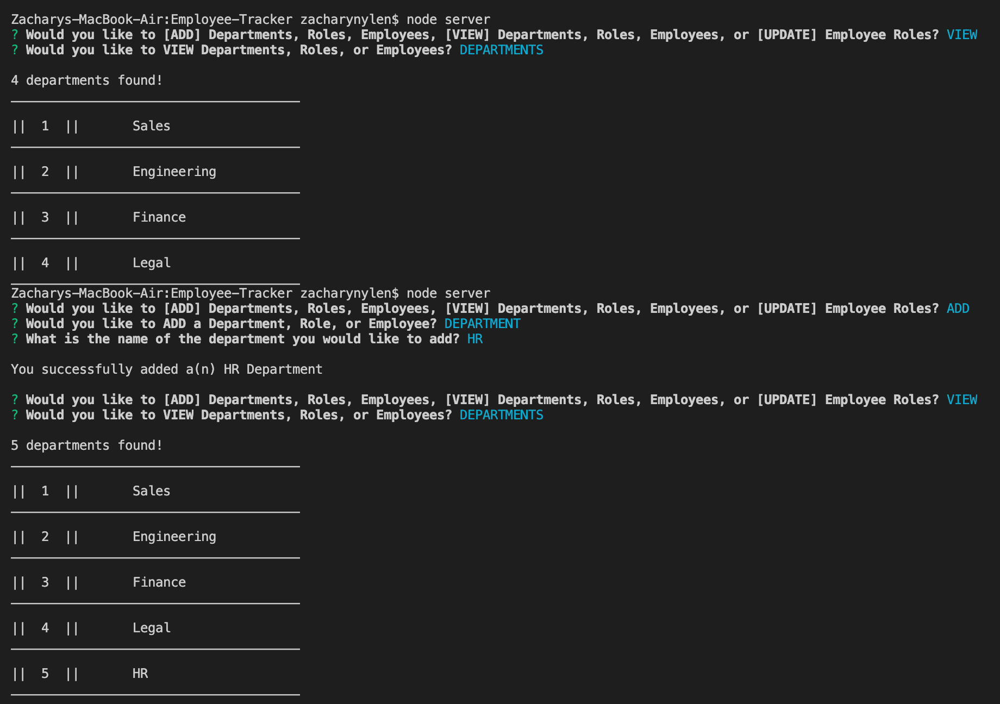
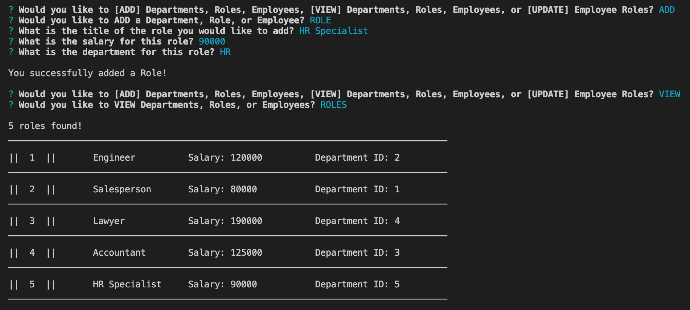
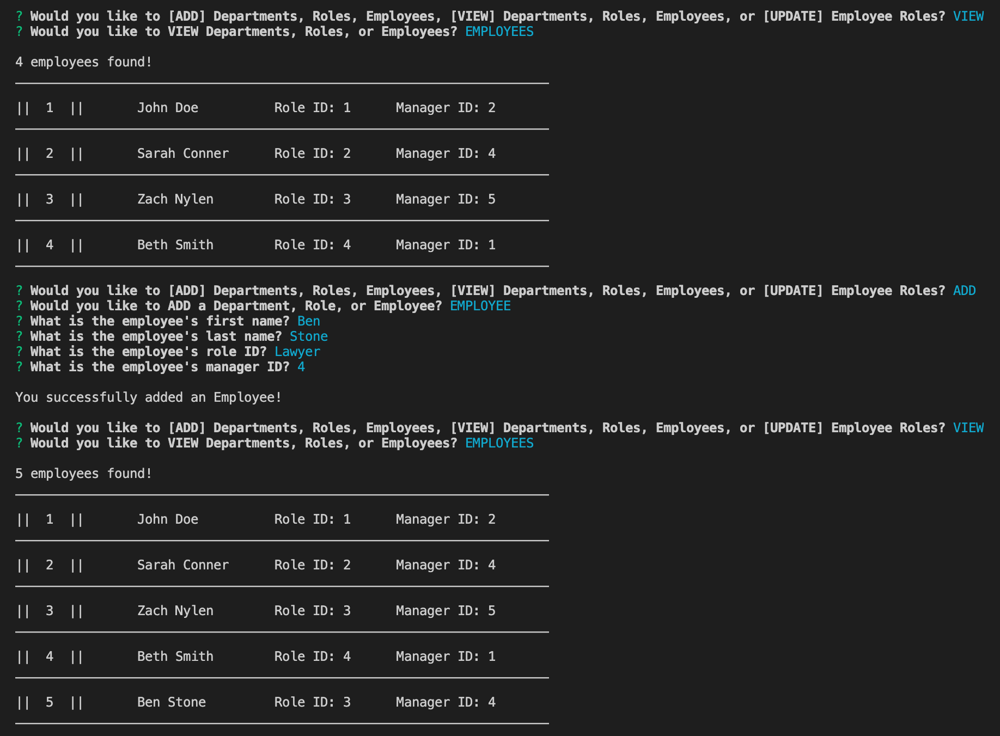

# Employee-Tracker
Application that can add/view departments, roles, and employees as well as update employee roles.

# Objective
Build a command-line application that at a minimum allows the user to:

  * Add departments, roles, employees

  * View departments, roles, employees

  * Update employee roles

## Description
This project was created using newly learned material related to creating servers, using MySql, and inquier prompts. It focuses heavily on user input to view, add, and update material via user prompts. The prompt answers work in conjunction with MySql methods such as "update" and "insert" to achieve this goal. Overall, the general backbone of the application was fairly straightforward to set up, however I did encounter some hangups. I still cant figure out how to best render out employee roles (which are set as an ID in the employee table) as an actual job title found within the role's table. This has to be achieved using the join method but I have yet to determine how to use it in this scenario. I will continue to update this project to fully achieve all the objectives set forward in the project ReadMe.

## Usage
1. Open the server.js file, open the terminal and "cd" into the correct directory.

2. Once inside the correct directory, install the required NPM installations using "npm i".

3. Invoke the following command within the terminal to get the app to run (node server).

4. The terminal will render the first prompt (Would you like to [ADD] Departments, Roles, Employees, [VIEW] Departments, Roles, Employees, or [UPDATE] Employee Roles?).

5. Click on any of the following choices to be given further prompts to achieve the selected goal. 

6. All prompts should revert back to the original prompt once an action has been succesfully performed.

7. An [EXIT] option will be available on most prompts in case the user wishes to start over from the beginning.

8. All actions that are succesfully performed will render a "success" message of some sort that tells the user that an action has been completed (ie. New role created, employee role updated, etc).

## Below is a screenshot of Add/View department functionality in terminal:

 

## Below is a screenshot of Add/View role functionality in terminal:

 
 
## Below is a screenshot of Add/View employee functionality in terminal:

 

